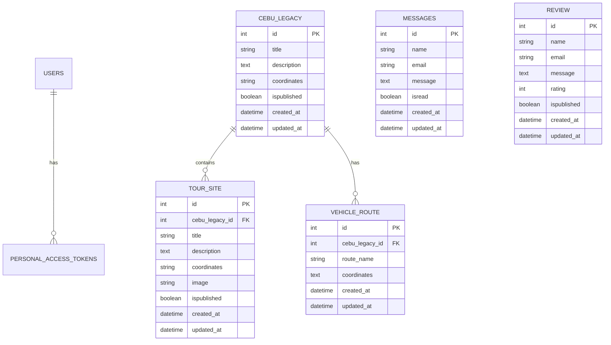
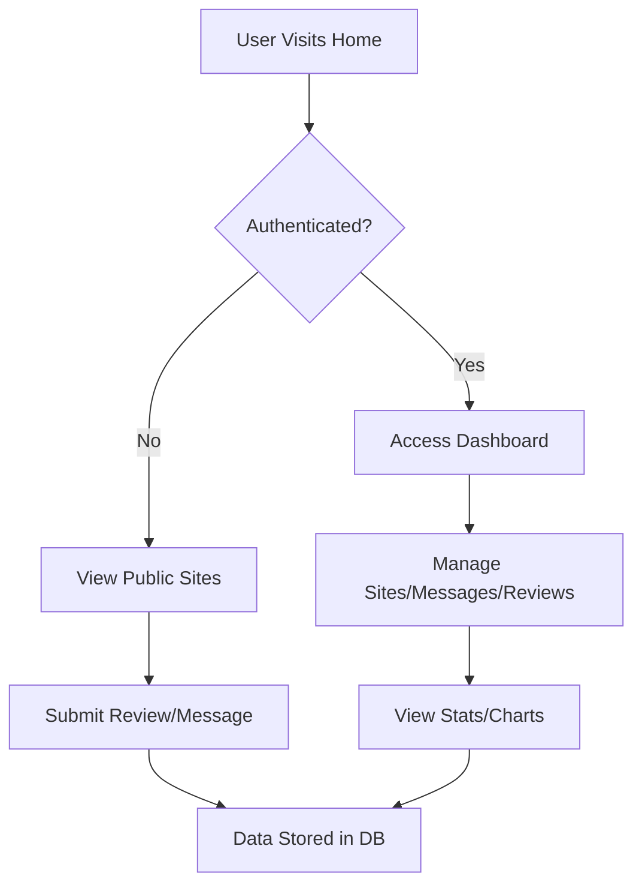

# Full Documentation for Suroysugbo Website

## 1. Overview
Suroysugbo is a web application for exploring Cebu tourism sites. It features a Laravel backend with a Vue.js frontend, using Inertia.js for seamless integration. The app allows users to view heritage sites, leave reviews, send messages, and manage content via an admin dashboard.

## 2. Tech Stack
- Backend: PHP 8.2+, Laravel 12.0 (framework), MySQL (database)
- Frontend: TypeScript, Vue.js 3.5.13, Inertia.js 2.0 (for SSR/SPA bridge)
- Styling: Tailwind CSS 4.1.1
- Build Tool: Vite 6.2.0
- Charts: Chart.js 4.5.0 with vue-chartjs 5.3.2
- Maps: Leaflet, vue3-google-map 0.22.0
- Icons: Lucide Vue Next 0.468.0
- Authentication: Laravel Sanctum 4.0
- Testing: Pest 3.8
- Deployment: Docker (with nginx, supervisord)
- Other Libraries: Axios 1.9.0, Ziggy 2.4 (for route helpers), SweetAlert2 11.22.0

## 3. System Architecture Diagram
```mermaid
graph TB
    subgraph "Frontend (Vue.js + TypeScript)"
        A[Vue Components] --> B[Inertia.js]
        C[Tailwind CSS] --> A
        D[Chart.js] --> A
    end
    subgraph "Backend (Laravel + PHP)"
        E[Controllers] --> F[Models]
        F --> G[Database (MySQL)]
        H[Routes] --> E
        I[Middleware] --> E
    end
    B --> H
    J[Docker] --> E
    K[Vite] --> A
```

## 4. Project Structure
```
suroysugbo/
├── app/                          # Laravel backend (controllers, models, providers)
├── bootstrap/                    # Laravel bootstrap files
├── config/                       # Configuration files (app.php, database.php, etc.)
├── database/                     # Migrations, seeders, factories
├── docker/                       # Docker configs (nginx.conf, supervisord.conf)
├── public/                       # Static assets (css/, img/, js/)
├── resources/                    # Frontend resources
│   ├── css/                      # Stylesheets
│   ├── js/                       # Vue.js components and scripts
│   └── views/                    # Blade templates (if any)
├── routes/                       # Route definitions (web.php, api.php, auth.php)
├── storage/                      # Logs, cache, app data
├── tests/                        # Pest tests (Feature/, Unit/)
├── vendor/                       # Composer dependencies
├── artisan                       # Laravel CLI tool
├── composer.json                 # PHP dependencies
├── package.json                  # Node.js dependencies
├── vite.config.ts                # Build config
├── Dockerfile                    # Docker setup
├── .env                          # Environment variables
└── phpunit.xml                   # Testing config
```

## 5. Installation and Setup
1. Prerequisites: PHP 8.2+, Node.js, Composer, MySQL, Docker (optional).
2. Clone Repository: `git clone <repo-url>`
3. Install PHP Dependencies: `composer install`
4. Install Node Dependencies: `npm install`
5. Environment Setup: Copy `.env.example` to `.env`, configure DB credentials (DB_CONNECTION=mysql, DB_DATABASE=suroydb, DB_USERNAME=root, DB_PASSWORD=root).
6. Generate App Key: `php artisan key:generate`
7. Run Migrations: `php artisan migrate`
8. Seed Database: `php artisan db:seed` (if seeders exist)
9. Build Frontend: `npm run build`
10.Start Server: `php artisan serve` (or use Docker: `docker-compose up`)

6. Key Features
- Tourism Site Exploration: View Cebu legacy sites with maps, images, and details.
- User Reviews: Submit and manage reviews for sites.
- Messaging: Contact form for user inquiries.
- Admin Dashboard: Authenticated users can manage sites, messages, reviews, and view stats (counts, charts).
- Authentication: Login/register with email verification.
- Responsive Design: Mobile-friendly with Tailwind CSS.
- Charts: Monthly visitor stats on dashboard using Chart.js.
- File Uploads: Image uploads for sites.
- API Endpoints: Public routes for reviews and messages.

## 7. API/Routes
- Public Routes:
  - `GET /` (home page)
  - `GET /cebu-legacy/view/{id}` (view site details)
  - `POST /message-post` (submit message)
  - `POST /review-post` (submit review)
- Authenticated Routes (require login):
  - `GET /dashboard` (admin dashboard with stats)
  - `GET /cebu-legacy` (list sites)
  - `GET /cebu-legacy/edit` (create site)
  - `POST /cebu-legacy/store` (save site)
  - `GET /cebu-legacy/edit/{id}` (edit site)
  - `PUT /cebu-legacy/update/{id}` (update site)
  - `DELETE /cebu-legacy/delete/{id}` (delete site)
  - `POST /cebu-legacy/image-upload` (upload images)
  - `DELETE /cebu-legacy/image-delete/{id}` (delete images)
  - `GET /messages` (list messages)
  - `GET /messages/{id}/read` (mark message read)
  - `GET /reviews` (list reviews)
  - `GET /reviews/{id}/read` (mark review read)
  - `POST /reviews/{id}/publish` (publish review)
- Auth Routes: Included from `auth.php` (login, register, password reset).
- Settings Routes: Included from `settings.php` (profile, password).

## 8. Database Schema
### Tables
- users: id (int, PK), name (string), email (string, unique), email_verified_at (datetime, nullable), password (string), remember_token (string, nullable), created_at (datetime), updated_at (datetime)
- cache: key (string, PK), value (text), expiration (int)
- jobs: id (bigint, PK), queue (string), payload (longtext), attempts (tinyint), reserved_at (int, nullable), available_at (int), created_at (int)
- job_batches: id (string, PK), name (string), total_jobs (int), pending_jobs (int), failed_jobs (int), failed_job_ids (longtext), options (mediumtext, nullable), cancelled_at (int, nullable), created_at (int), finished_at (int, nullable)
- failed_jobs: id (bigint, PK), uuid (string), connection (text), queue (text), payload (longtext), exception (longtext), failed_at (datetime)
- personal_access_tokens: id (bigint, PK), tokenable_type (string), tokenable_id (bigint), name (string), token (string, unique), abilities (text, nullable), last_used_at (datetime, nullable), expires_at (datetime, nullable), created_at (datetime), updated_at (datetime)
- sessions: id (string, PK), user_id (bigint, nullable), ip_address (string, nullable), user_agent (text, nullable), payload (longtext), last_activity (int)
- password_reset_tokens: email (string, PK), token (string), created_at (datetime, nullable)
- cebu_legacy: id (int, PK), title (string), description (text), coordinates (string), ispublished (boolean), created_at (datetime), updated_at (datetime)
- messages: id (int, PK), name (string), email (string), message (text), isread (boolean), created_at (datetime), updated_at (datetime)
- review: id (int, PK), name (string), email (string), message (text), rating (int), ispublished (boolean), created_at (datetime), updated_at (datetime)
- tour_site: id (int, PK), cebu_legacy_id (int, FK), title (string), description (text), coordinates (string), image (string), ispublished (boolean), created_at (datetime), updated_at (datetime)
- vehicle_route: id (int, PK), cebu_legacy_id (int, FK), route_name (string), coordinates (text), created_at (datetime), updated_at (datetime)

### Relationships
- CebuLegacy has many TourSites (one-to-many)
- CebuLegacy has many VehicleRoutes (one-to-many)
- Users has many PersonalAccessTokens (one-to-many)

## 9. Database ER Diagram


## 10. Frontend Components
Pages (resources/js/pages/):
- Welcome.vue (landing page)
- Dashboard.vue (admin stats with chart)
- Index.vue, Edit.vue (manage sites)
- Index.vue (manage messages)
- Index.vue (manage reviews)
- Index.vue, View.vue (public site views)
- Auth pages (Login.vue, Register.vue, etc.)

Components (resources/js/components/):
- AppLayout.vue, AppSidebar.vue, AppHeader.vue (layouts)
- PlaceholderPattern.vue (UI placeholder)
- UserMenuContent.vue, DeleteUser.vue (user management)

Layouts (resources/js/layouts/): Auth layouts for login/register.

Types (resources/js/types/): Ziggy route types.

Styling: Tailwind classes in templates; static CSS in public/css/.

## 11. Backend Components
Controllers (app/Http/Controllers/):
- DashboardController.php (dashboard data)
- TourController.php (public views)
- CebuLegacyController.php (site CRUD)
- MessageController.php (message CRUD)
- ReviewController.php (review CRUD)
- Auth Controllers (login, registration)

Models (app/Models/):
- User.php (user model)
- CebuLegacy.php (site model)
- TourSite.php (sub-site model)
- VehicleRoute.php (route model)
- Message.php (message model)
- Review.php (review model)

## 12. User Journey Flow Diagram


## 13. Deployment
- **Docker**: Use Dockerfile and docker/ configs for containerized deployment.
- **Production**: Set APP_ENV=production in .env, run `npm run build`, use nginx/supervisord for serving.
- **Environment**: Configure .env for production DB, mail, etc.
- **Static Assets**: Served from public/, built via Vite.

## 14. Testing
- **Framework**: Pest (PHP testing).
- **Run Tests**: `vendor/bin/pest` or `php artisan test`.
- **Test Files**: In tests/Feature/ and tests/Unit/.
- **Coverage**: Use Pest plugins for detailed reports.

## 15. Configuration Files
- .env: Environment variables (DB, app key, etc.).
- vite.config.ts: Build configuration for Vite.
- composer.json: PHP dependencies.
- package.json: Node.js dependencies.
- Dockerfile: Docker image setup.
- docker/nginx.conf: Nginx config.
- docker/supervisord.conf: Process manager.

